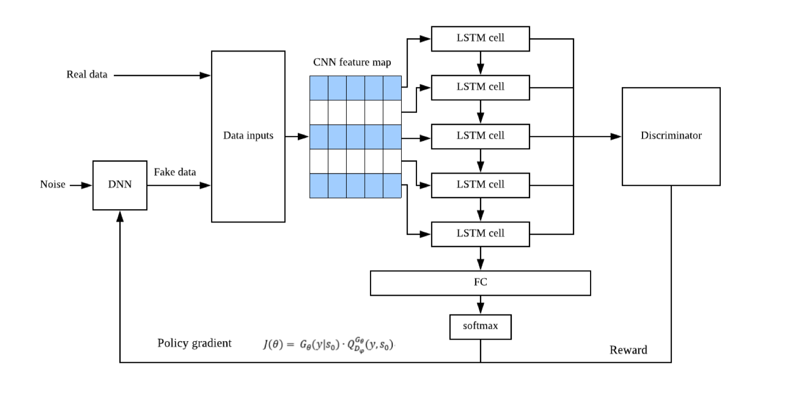
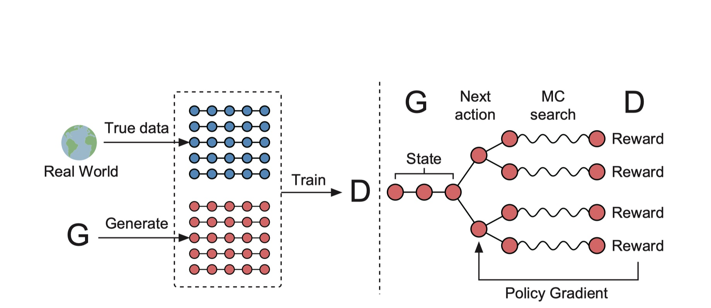
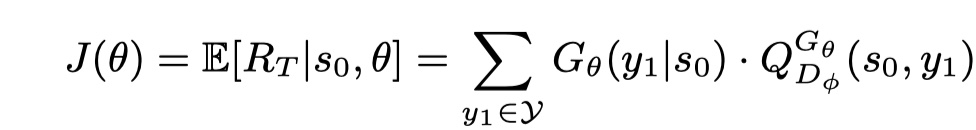
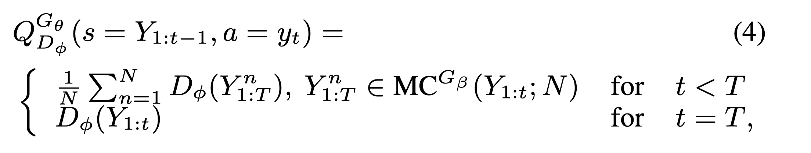

## 第四次报告内容

### C-LSTM与判别器的保留问题

- $G_\theta (y|s_0)$在GAN+RL实际上是表示一个概率值，表示强化学习中生成一个y的概率值,在本文中没有必要乘上。

### SeqGan

- 我们可以知道G的离散输出，让D很难回传一个梯度用来更新G，因此需要做一些改变，看上图（右），paper中将policy network当做G，已经存在的红色圆点称为现在的状态（state），要生成的下一个红色圆点称作动作（action），因为D需要对一个完整的序列评分，所以就是用MCTS（蒙特卡洛树搜索）将每一个动作的各种可能性补全，D对这些完整的序列产生reward，回传给G，通过增强学习更新G。这样就是用Reinforcement learning的方式，训练出一个可以产生下一个最优的action的生成网络。

- 生成器G的目标是生成sequence来最大化reward的期望。

  

  

  

  - 在这里把这个reward的期望叫做J(θ)。就是在$s_0$和θ的条件下，产生某个完全的sequence的reward的期望。其中$G_θ()$部分可以轻易地看出就是Generator Model。而$Q_{D_φ}^{G^θ()}$（Q值）在文中被叫做一个sequence的action-value function 。因此，我们可以这样理解这个式子：G生成某一个y1的概率乘以这个y1的Q值，这样求出所有y1的概率乘Q值，再求和，则得到了这个J(θ)，也就是我们生成模型想要最大化的函数。

  

