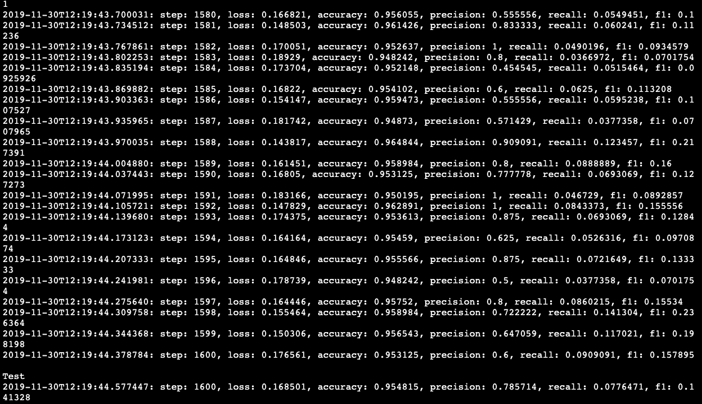

## Report 7

- 学习GAN+CLSTM的代码逻辑(按照计划)

  - Generator

    - generator fake sample

    - Pretrain network(clstm)

  - Discriminator

    - dense层
    - dropout层

- 代码实践

  - 尝试运行gan(使用改正过后的dataloader，不加上clstm)

    
    - 运行结果和单独使用clstm结果相似

  - 尝试gan+clstm

    - 仍然有bug

- 下一步工作

  - 和小组成员讨论，将gan+clstm整个框架搭建起来

