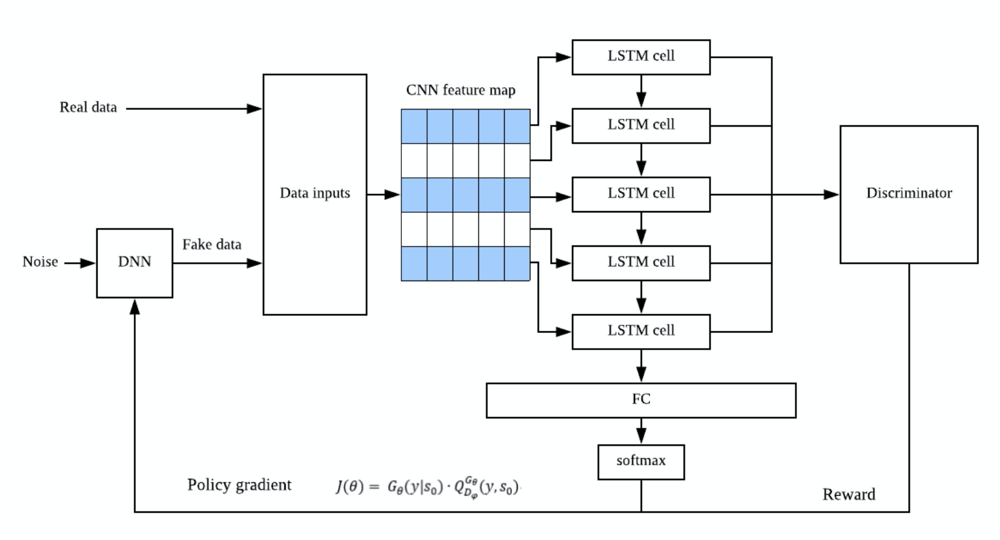
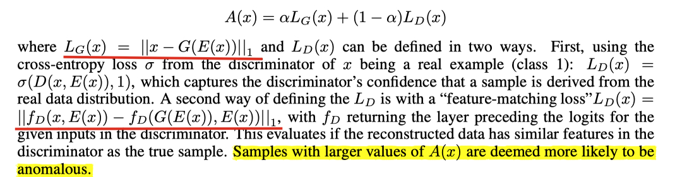
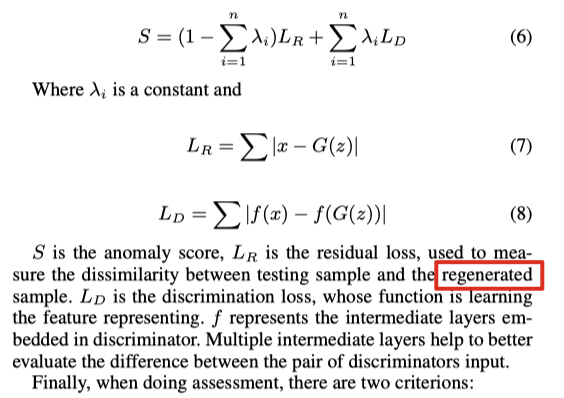

# Report 3

## 汇集三篇重要引文的思想

- seqGAN

    - 论文内容：RL + GAN 用于文本生成

        论文的出发点也是意识到了标准的GAN在处理像序列这种离散数据时会遇到的困难，主要体现在两个方面：Generator难以传递梯度更新，Discriminator难以评估非完整序列。

        对于前者，作者给出的解决方案对我来说比较熟悉，即把整个GAN看作一个强化学习系统，用Policy Gradient算法更新Generator的参数；对于后者，作者则借鉴了蒙特卡洛树搜索（Monte Carlo tree search，MCTS）的思想，对任意时刻的非完整序列都可以进行评估。
        $$
        J(\theta)=\mathbb{E}\left[R_{T} | s_{0}, \theta\right]=\sum_{y_{1} \in \mathcal{Y}} G_{\theta}\left(y_{1} | s_{0}\right) \cdot Q_{D_{\phi}}^{G_{\theta}}\left(s_{0}, y_{1}\right)
        $$

    - 可借鉴的方面：解决和"时序"的问题，让GAN可以用于生成序列。但是生成的是离散数据序列，还不是连续数据的序列。

- CLSTM
    - 论文内容：CNN+LSTM 进行文本分类
    - 可借鉴的方面：对于序列型数据，可以同时提取时间和空间特征，弥补了单独使用CNN或RNN的不足。

- effective GAN-based AD
    - 提供了GAN用于异常检测的基本思路；利用AE提高推断效率
    - 可借鉴的方面：GAN用于异常检测的基本框架。

## 重新审视交大报告的方案

整体思路是好的。首先基于Effective GAN-based AD论文中的模型为基础，利用GAN做异常检测。但是希望能在这个基础上寻求一个突破：能够考虑序列的时序问题。

首先参考 seqGAN，解决了GAN生成序列的问题，但是生成的是"文本"这种离散数据的序列，所以不能用于异常检测，但是可以借鉴其强化学习的思想(?)。其次再去参考了 C-LSTM，可以尝试把它加入到GAN中。

> 可以思考的问题：C-LSTM 怎么加入到 GAN 中？作为生成器还是作为判别器？还是代替编码器的作用？

比较玄的地方：

1. 强化学习到底是怎么工作的？

    seqGAN的策略梯度目标函数：
    $$
    J(\theta)=\mathbb{E}\left[R_{T} | s_{0}, \theta\right]=\sum_{y_{1} \in \mathcal{Y}} G_{\theta}\left(y_{1} | s_{0}\right) \cdot Q_{D_{\phi}}^{G_{\theta}}\left(s_{0}, y_{1}\right)
    $$
    交大报告的策略梯度目标函数：

    其中G是C-LSTM的输出，Q是判别器的输出

    其次，cnn能和强化学习结合吗？因为 seqGAN 引入强化学习的目的是因为序列这种离散型数据难以对LSTM生成器进行梯度更新。

2. 异常评估函数的设计与模型不符

Effective GAN-based AD的异常评估函数：

交大报告的异常评估函数：

3. 真的具备针对single data进行推断的能力吗？

## 评价

### 训练阶段

只用正常数据进行训练，通过GAN的对抗学习过程，让网络能够充分学到正常数据的时空分布特征。

tricks：滑窗

### 推断阶段

设计一个评估异常的函数，设定一个阈值。输入数据，计算其异常函数的值，与阈值进行比较，判断是否异常。
